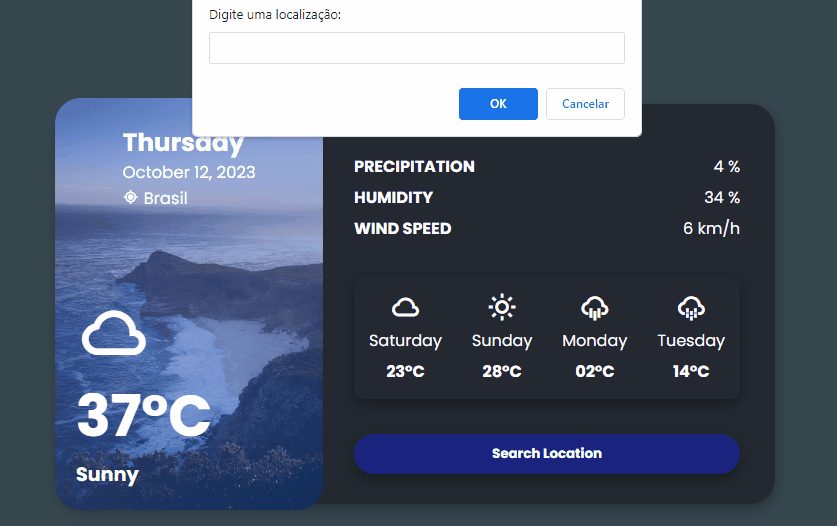
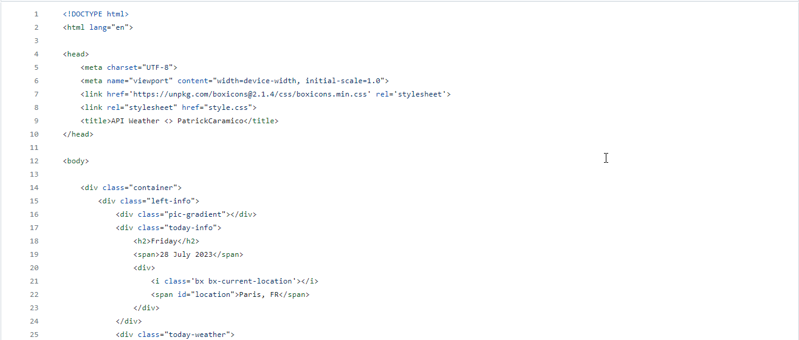
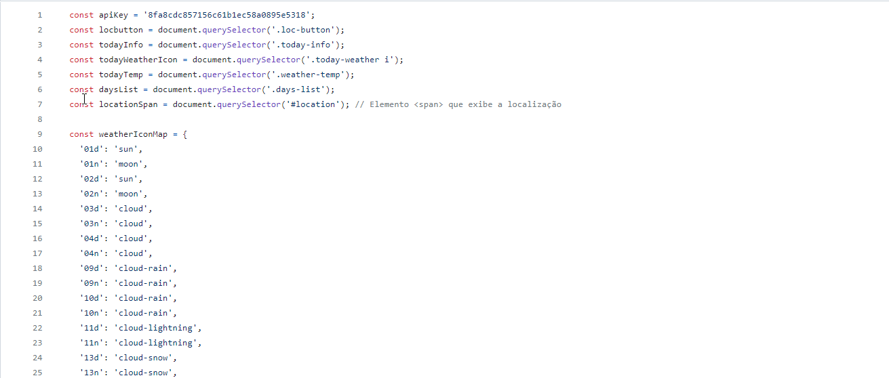

# Project_time

Weather API with Search

## Readme Contents:
- [Summary](#summary)
  - [About the project](#about)
  - [preview](#preview)
- [My code](#codes)
  - [HTML](#html)
  - [CSS](#css)
  - [Javascript](#js)
- [Process](#process)
  - [Designed](#designed)
  - [Learned](#learned)
- [Autor](#autor)
  - [Credits](#credits)
  - [link](#link)

## summary

### about

Esse projeto é uma ideia de com API que mostra o clima numa localização expecifica, quando o usuario pesquisa sobre essa região, essa ideia foi um project criado pelo "AsmrProg", onde ele apresentava esse projeto para fazer.

### preview

## My Code

### codes

### html

Code HTML

### css

Code CSS

### js

Code Javascript

## process

### designed

- Semantic HTML;
- CSS priorities;
- API;
- Javascript functions;
- Weather API.

### learned

🟢 API Weather;  

## Autor

### autor

### credits

### link

**Link to acess the project:**
https://time-project-api.netlify.app/

