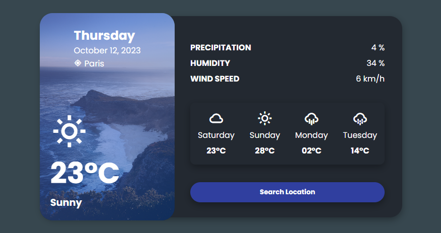

# Project_time

API de clima com pesquisa

## Readme Contents:
- [Summary](#summary)
  - [About the project](#about)
  - [Screenshot](#screenshot)
  - [preview](#preview)
- [My code](#codes)
  - [HTML](#html)
  - [CSS](#css)
  - [Javascript](#js)
- [Process](#process)
  - [Designed](#designed)

## summary

### about

Esse projeto é uma ideia de com API que mostra o clima numa localização expecifica, quando o usuario pesquisa sobre essa região, essa ideia foi um project criado pelo "AsmrProg", onde ele apresentava esse projeto para fazer.

### screenshot

### preview

## My Code

### codes

### html

Code HTML

### css

Code CSS

### js

Code Javascript

## process

### designed

